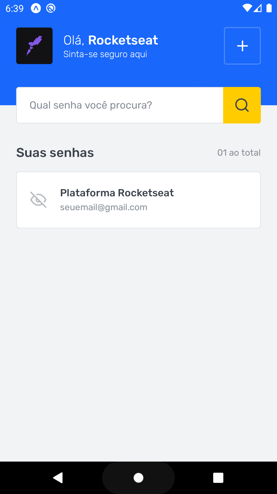
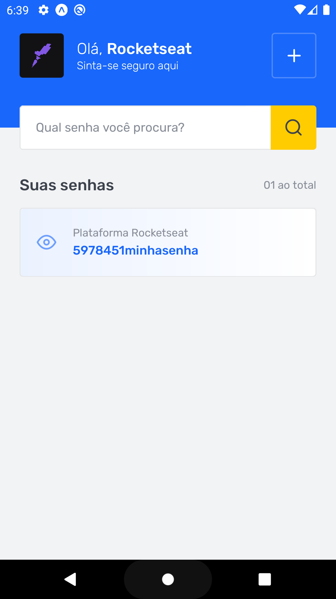

<h1 align="center">
    
</h1>

<h2 align="center">Desafio - SavePass</h2>

 

  <a href="#-tecnologias">Tecnologias</a>&nbsp;&nbsp;&nbsp;|&nbsp;&nbsp;&nbsp;
  <a href="#-projeto">Sobre o desafio</a>&nbsp;&nbsp;&nbsp;|&nbsp;&nbsp;&nbsp;
  <a href="#-projeto">Rodando a aplicação</a>&nbsp;&nbsp;&nbsp;|&nbsp;&nbsp;&nbsp;
  <a href="#-tecnologias">Rodando os testes</a>&nbsp;&nbsp;&nbsp;

## 📦 Tecnologias

- Expo

## 📦 Sobre o desafio

Implementar uma aplicação de gerenciamento de senhas: SavePass.

Essa aplicação possui duas telas, sendo a primeira delas uma listagem das senhas salvas e a segunda a tela de cadastro de novos logins.

## 📦 Telas

## 📦 Rodando a aplicação

- Clone o repositório
- Instale as dependências com `yarn install`
- rode o comando `expo start` e em seguida abra o navegador e coloque o endereço o emulador ou próprio dispositivo.

## 📦 Rodando os testes

- Rode o comando `yarn test`
- O projeto possui dois testes: Testes Home e Testes RegisterLoginData